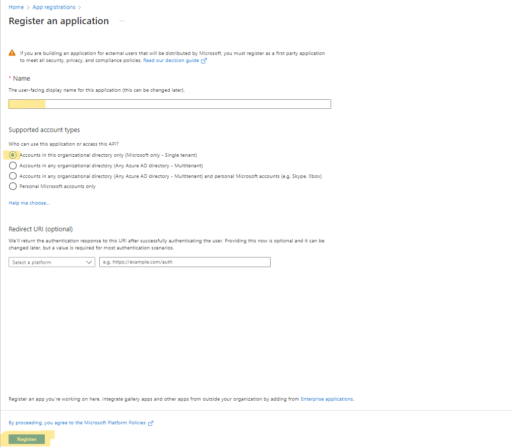
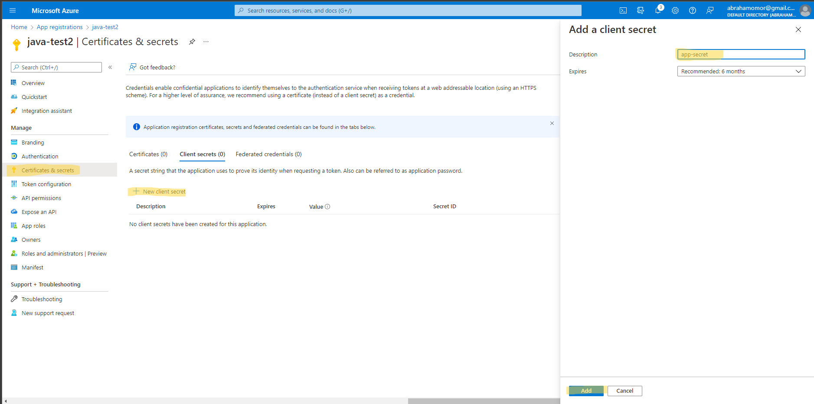

# azuremlflow-java
A simple Java example using the MLflow tracking client with the Azure ML tracking server

!NOTE Make sure you have Admin permission for the AzureML workspace you are run your java application

## Create an App Registration in Azure
1) Enter a name
2) Select Supported account types. (Recommeneded choice: Accounts in this organizational directory only (Microsoft only - Single tenant))
3) Click Register

## Give the App Permission to your Azure ML workspace
1) Find your AzureML workspace in Azure Portal
2) Select the Access Control and add a new role for the service princple created in the App Registration above.

3) Add the Service Principle as a "Contributor" to the AzureML workspace

## Obtain Secrets for Appilication 

1) Find your App Registration in Azure Portal (We create this in the first step)
2) Select the Certificates & secrets and add a new client secret for the app.

3) Enter the client secret (AZUREMLFLOW_SP_CLIENT_SECRET) in the [Job YAML File](/job.yml) in the environment variable section. 
4) Enter the rest of the infomation from the workspace you want to use.
